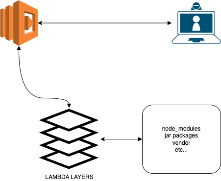

# Lambda Layer



Module prebuilt for automate the installing dependencies for function lambdas made in node.js


## Requirements

- Terraform version:  `1+`
- yarn
- node.js version: 14+

### How to use

```hcl

module "layer" {
  source = "hendrixroa/lambda-layer/aws"

  lambda_layer_name = "LambdaNodejsLayer"
  s3_bucket_id      = aws_s3_bucket.mybucket.id
}
```

- See `
- layer/package.json` to see which dependencies I have installed, feel free to add the dependencies that you need via PR. 
